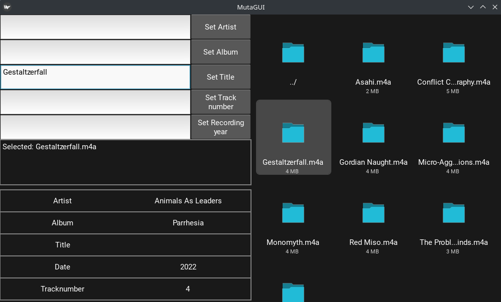

# Mutagen-EZ-GUI
This is a GUI client for setting audio metadata, based on the Mutagen Python library (https://github.com/quodlibet/mutagen). It features a file chooser for easy file navigation and selection, and fields for setting the most common metadata tags. Users can set the same tag on multiple files simultaneously.
Supports .mp3, .mp4 family, vorbis family, .wav and .flac files.

## Screenshot

## Requirements
- Python (tested on 3.10)
- Python packages in `requirements/prod.txt`

## How to run
1. Install requirements (preferrably in a Python virtualenv):
    `pip install -r requirements/prod.txt`
2. Run the `main.py` file in Python:
    `python src/mutagen_ez_gui/main.py`
